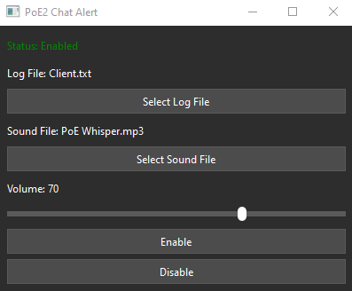

   ## For .exe Installation:

1. Download `PoE2_Chat_Alert.exe` from the releases [here.](https://github.com/Distorted203/Path-of-Exile-2/releases/tag/v1.1)
   - If you want the Path of Exile 1 notification sound, Download the `PoE1_Alert_Sound.mp3` as well.
2. Create a folder and place the `PoE2_Chat_Alert.exe` (and optionally the audio file) in it.
2. Launch the application and click **"Select Log File"**.
3. Navigate to the `Client.txt` file in the Path of Exile folder.

   - **If you are using Steam**:
     `Steam --> steamapps --> common --> Path of Exile 2 --> logs --> client.txt`

   - **If you are using the GGG Launcher**:
     - Go to the Path of Exile 2 installation folder.
     - `Path of Exile 2 --> logs --> client.txt`

4. Click **"Select Sound File"**:
   - Select the `PoE1 Alert Sound.mp3` file or another sound file of your choice.
   - Supports `.mp3` or `.wav` files.

5. Click **Enable**.

---

## Notes:
- The `.exe` file may trigger antivirus warnings because it is unsigned. It is safe to use, and the source code is available for review.
- On the top right of the window, clicking `_` will minimize the application to the tray, while clicking `x` will exit/close the application completely.
- A configuration file (`config.json`) will be created upon selecting your files to save your settings for future use.


---
---


## For Python (.py) File:
Below is the list of dependencies required:

```plaintext
pillow==11.1.0
pygame==2.6.1
PyQt6==6.8.0
pystray==0.19.5
```

---

## Installation

1. Download the .zip file and extract it.

2. Navigate to the project directory:
```bash
cd PoE2_Chat_Alert_Python
```

3. Create and activate a Virtual environment (optional):

 **Windows**
```bash
python -m venv .venv
```
```bash
.\.venv\Scripts\activate
```

 **Mac/Linux:**
 ```bash
python3 -m venv .venv
 ```
 ```bash
source .venv/bin/activate
```

4. Install the required dependencies:
```bash
pip install -r requirements.txt
```

5. Run Script:
```bash
python PoE2_Chat_Alert.py
```

## Screenshot


